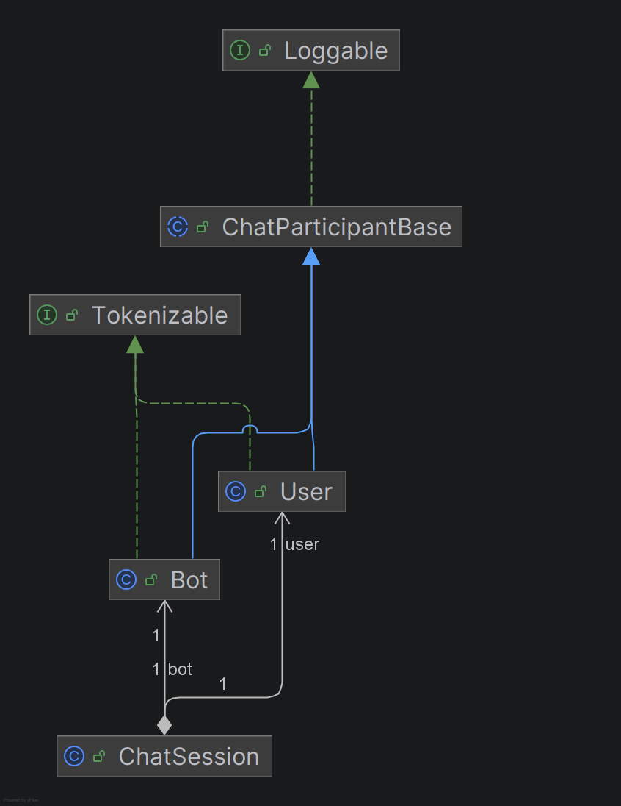
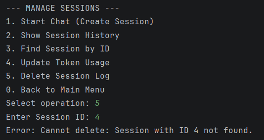

# Chatbot Platform API

- [A. Project Overview](#a-project-overview)
- [B. OOP Design Documentation](#b-oop-design-documentation)
- [C. Database Description](#c-database-description)
- [D. Controller](#d-controller)
- [E. Instructions to Compile and Run](#e-instructions-to-compile-and-run)
- [F. Screenshots](#f-screenshots)
- [G. Reflection Section](#g-reflection-section)

## A. Project Overview

This project is a Java-based API developed for Assignment 3. The purpose of the API is to manage the lifecycle of AI personas (Bots), Users, and their interactions (Chat Sessions). The application is built using a layered architecture (Controller-Service-Repository) and connects to a PostgreSQL database using JDBC.

The system models three main entities:
* **Bot**: Represents an AI character with a specific definition and token limit.
* **User**: Represents a human user with a specific persona.
* **ChatSession**: Represents a composite entity linking a User and a Bot, now fully persisted in the database with usage statistics.

The project demonstrates advanced Object-Oriented Programming concepts, including inheritance, polymorphism, and **Dependency Injection** (injected Repositories and Database providers). It implements data persistence using raw SQL queries via `PreparedStatement` to ensure security and performance.

---

## B. OOP Design Documentation

### Abstract class and subclasses
The project uses an inheritance hierarchy to minimize code duplication.
* **`ChatParticipantBase` (Abstract Class)**: Defines the common state (`id`, `name`) and behavior for all participants.
* **`Bot` (Subclass)**: Extends the base class and adds fields for `greeting`, `definition`, and `tokenLimit`.
* **`User` (Subclass)**: Extends the base class and adds `persona` and `isPremium` status.

### Interfaces and implemented methods
* **`Tokenizable` (Business Logic Interface)**: Defines `estimateTokenUsage()`. Both `Bot` and `User` implement this to calculate computational costs differently.
* **`IDB` (Infrastructure Interface)**: Defines the contract for database connections (`getConnection`).
    * Implemented by **`PostgresDB`**: Handles the specific JDBC driver logic and credentials. This allows decoupling the application logic from the specific database implementation.

### Composition/aggregation
* **`ChatSession` Class**: Aggregates `Bot` and `User` objects. It tracks the start time and the `totalTokensUsed` for the interaction, providing a snapshot of the conversation cost.

### Polymorphism examples
* **Repositories**: The `ChatService` relies on the `IDB` interface, not a concrete database class, allowing for flexible dependency injection.
* **Domain Models**: `ChatParticipantBase` references allow treating Bots and Users uniformly in certain contexts (e.g., logging names).

### UML diagram



---

## C. Database Description

The project uses a relational database (PostgreSQL) named `chatbot_platform`.

### Schema, constraints, foreign keys

1.  **users**
    * `id` (SERIAL, PK): Unique identifier.
    * `name` (VARCHAR): User's name. Not Null.
    * `persona` (TEXT): Description of the user.
    * `is_premium` (BOOLEAN): Premium status flag.

2.  **bots**
    * `id` (SERIAL, PK): Unique identifier.
    * `name` (VARCHAR): Bot's name. Not Null.
    * `greeting` (TEXT): Initial message.
    * `definition` (TEXT): System instructions.
    * `token_limit` (INT): Check constraint `CHECK (token_limit > 0)`.

3.  **chat_sessions**
    * `id` (SERIAL, PK): Unique identifier.
    * `bot_id` (INT): FK referencing `bots(id)`. ON DELETE CASCADE.
    * `user_id` (INT): FK referencing `users(id)`. ON DELETE CASCADE.
    * `started_at` (TIMESTAMP): Session start time.
    * `total_tokens_used` (INT): Stores the calculated context load for the session.

### Sample SQL inserts (from resources/schema.sql)

```sql
INSERT INTO users (name, persona, is_premium) VALUES 
('Alice', 'Friendly girl trying to find her way home.', TRUE);

INSERT INTO bots (name, greeting, definition, token_limit) VALUES 
('Wonderland', '*You know the beginning...*', 'You are the Narrator...', 16000);
```

---

## D. Controller

The `Main` class serves as the Controller layer. It configures the application using **Dependency Injection** (wiring Repositories with the Database provider) and exposes full CRUD operations via CLI.

### Menu Structure
1.  **Manage BOTS**: Sub-menu for Creating, Reading (All/ById), Updating, and Deleting Bots.
2.  **Manage USERS**: Sub-menu for Creating, Reading (All/ById), Updating, and Deleting Users.
3.  **Manage SESSIONS**: Sub-menu for Starting Chats, Viewing History, Updating Tokens, and Deleting Logs.

### Architecture Flow
* **Controller (`Main`)**: Handles user input via `Scanner`, displays menus, and delegates logic to the Service layer.
* **Service (`ChatService`)**: Validates input (e.g., checks for empty names, negative limits) and calls Repositories.
* **Repository Layer**: Executes raw SQL queries using `PreparedStatement`.
* 
---

## E. Instructions to Compile and Run

### 1. Database Setup (Required)
Before running the application, you must initialize the database:
1.  Create a new PostgreSQL database named `chatbot_platform`.
2.  Open the file `resources/schema.sql` and execute the SQL script inside your database manager (pgAdmin / DBeaver).
    * *This creates the required tables and columns (including `total_tokens_used`).*

### 2. Configuration (Environment Variables)
The application uses **Environment Variables** for security, but includes a fallback for local testing.
* **Option A (Recommended):** Set the following Environment Variables in your IDE run configuration:
    * `DB_HOST` (e.g., localhost:5432)
    * `DB_NAME` (e.g., chatbot_platform)
    * `DB_USER` (e.g., postgres)
    * `DB_PASSWORD` (your actual password)
* **Option B (Quick Start):** Open `src/controller/Main.java`, locate the "Configuration" block at the start of the `main` method, and update the default password string:
    ```java
    if (dbPass == null) dbPass = "YOUR_REAL_PASSWORD"; 
    ```

### 3. Build and Run
Navigate to the `src` directory in your terminal:

```bash
# Compile (ensure the JDBC driver path is correct)
javac -cp ".:../lib/postgresql-42.7.2.jar" controller/Main.java

# Run
java -cp ".:../lib/postgresql-42.7.2.jar" controller.Main
```
*(Note: If using IntelliJ IDEA, simply Run `Main.java` via the green play button. Ensure the PostgreSQL library is added to Project Structure -> Modules -> Dependencies).*

---
## F. Screenshots

### 1. Main Hierarchical Menu
The new entry point of the application, allowing selection between Bots, Users, and Sessions entities.


### 2. Bot Management Sub-Menu
Demonstrates the specific CRUD operations available for Bots (Create, Show All, Find by ID, Update, Delete).


### 3. Session History & Logic
Shows the session history table, displaying linked Bot IDs and User IDs correctly persisted in the database.


### 4. Robust Error Handling
Demonstrates the system catching invalid inputs (e.g., entering text instead of a numeric ID) without crashing.


---

## G. Reflection Section

* **What you learned**: I learned how to refactor a monolithic application into a clean architecture using **Dependency Injection**. Moving from a static `DatabaseConnection` class to an `IDB` interface implementation (`PostgresDB`) taught me how to make code more testable and flexible. I also mastered raw SQL queries for Update and Delete operations.
* **Challenges faced**: Transitioning to Environment Variables was tricky initially, as I had to configure the IDE correctly to pass the credentials. Implementing the `Update` logic was also challenging, as it required mapping all fields correctly in the `PreparedStatement`.
* **Benefits of JDBC and multi-layer design**: Using JDBC allows for persistent data storage, meaning data is not lost when the program closes. The multi-layer design makes the application modular; for example, I can change the database logic in the `Repository` without breaking the code in the `Main` menu. `PreparedStatement` also provides security against SQL injection, which is a crucial benefit over simple string concatenation.
