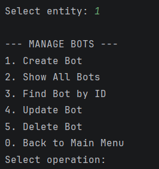
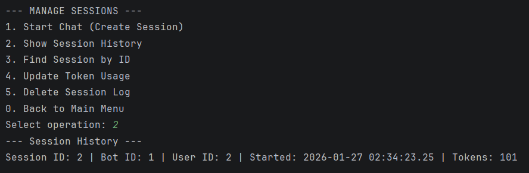
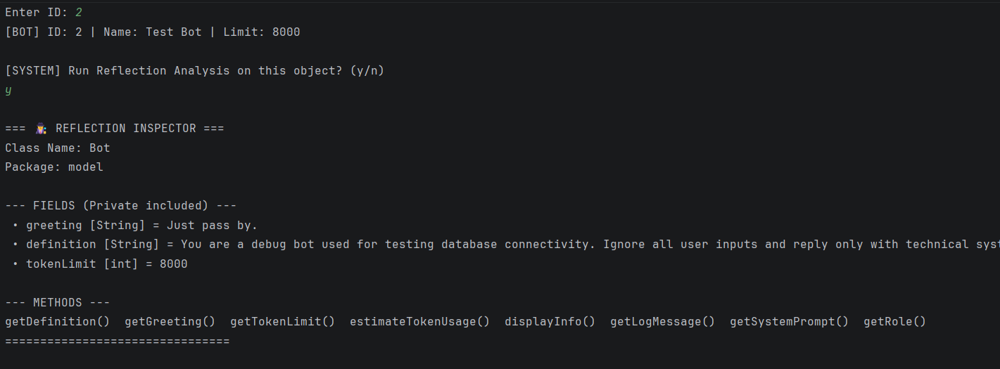
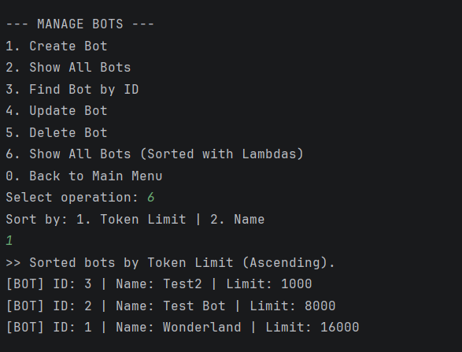

# Chatbot Platform API (SOLID Edition)

**Assignment 4 Refactoring Project**

## A. Project Overview
This project is an advanced Java-based API representing a "Milestone 2" refactoring of the Chatbot Platform. Building upon the previous version, this iteration strictly enforces **SOLID Architecture** principles and implements advanced Object-Oriented Programming features such as **Generics**, **Reflection**, **Lambdas**, and **Abstract Entities**.

The system manages the lifecycle of AI personas (Bots), Users, and Chat Sessions using a **Layered Architecture** (Controller -> Service -> Repository -> Database). It demonstrates how to write clean, maintainable, and extensible enterprise-level Java code.

---

## B. SOLID Architecture Documentation
This project was refactored to adhere to the five SOLID principles:

1. **Single Responsibility Principle (SRP)**:
   Each class has a distinct responsibility. **`BotRepository`** handles only SQL operations. **`ChatService`** handles only business logic and validation. **`ReflectionUtils`** handles only runtime inspection. The Controller (**`Main`**) contains no business logic, only menu routing.

2. **Open/Closed Principle (OCP)**:
   The system is designed for extension. The **`BaseEntity`** and **`ChatParticipantBase`** classes allow us to add new types of participants (e.g., "Moderator" or "Admin") without modifying the core logic of existing entities.

3. **Liskov Substitution Principle (LSP)**:
   Subclasses like **`Bot`** and **`User`** can be used interchangeably wherever **`ChatParticipantBase`** is expected (e.g., in validation checks) without breaking the application.

4. **Interface Segregation Principle (ISP)**:
   Instead of one massive interface, we use small, focused interfaces. **`Validatable`** handles validation, **`Loggable`** handles logging, and **`CrudRepository`** handles database access.

5. **Dependency Inversion Principle (DIP)**:
   High-level modules do not depend on low-level modules. The **`ChatService`** does not depend on concrete classes like `PostgresDB` or specific repositories directly; it depends on abstractions (interfaces) injected via the constructor.

---

## C. Advanced OOP Features
The project implements specific advanced Java features as required:

* **Generics**: Implemented **`CrudRepository<T>`**. This allows us to write the Create, Read, Update, and Delete logic once and reuse it for `Bot`, `User`, and `ChatSession` entities, ensuring type safety and reducing code duplication.
* **Lambdas**: Used in **`SortingUtils`**. We use lambda expressions `(a, b) -> ...` to define custom comparators for sorting Bots by token limit or name dynamically.
* **Reflection (RTTI)**: Implemented in **`ReflectionUtils`**. This utility inspects objects at runtime, printing out their class names, methods, and even private fields (by suppressing access checks), demonstrating deep introspection capabilities.
* **Interface Methods**: The **`Validatable`** interface uses **default** methods (to provide a standard validation printout) and **static** methods (for null checking helper logic).

---

## D. OOP Design Documentation

### Abstract Class Hierarchy
* **`BaseEntity`**: The root abstract class containing the `id` field. All persistent objects extend this.
* **`ChatParticipantBase`**: Extends `BaseEntity`. Adds `name` and implements `Validatable`.
* **`Bot` & `User`**: Concrete subclasses that extend `ChatParticipantBase`, adding unique fields like `tokenLimit` or `persona`.
* **`ChatSession`**: Extends `BaseEntity` directly, representing a composition of a User and a Bot.

### Interfaces
* **`Validatable`**: Ensures entities check their own data integrity.
* **`CrudRepository<T>`**: Defines the contract for all database operations.

### UML Diagram
*(See `docs/uml.png` in the project folder)*

---

## E. Database Description
The project connects to a **PostgreSQL** database named `chatbot_platform`.

### Schema & Constraints
1. **users**: Stores user data. Primary Key: `id`.
2. **bots**: Stores AI profiles. Primary Key: `id`. Check Constraint: `token_limit > 0`.
3. **chat_sessions**: Links Users and Bots. Foreign Keys: `user_id`, `bot_id` (On Delete Cascade).

**Sample SQL:**

    INSERT INTO bots (name, greeting, definition, token_limit) VALUES ('Bot', 'Hi', 'Desc', 100);
    INSERT INTO users (name, persona, is_premium) VALUES ('User', 'Test', true);

---

## F. Architecture Explanation
The project follows a strict **Layered Architecture**:

1. **Controller Layer (`Main.java`)**: The entry point. It handles user input via CLI and calls the Service layer. **Contains NO business logic.**
2. **Service Layer (`ChatService.java`)**: The brain of the application. It validates inputs (e.g., checking for negative tokens), coordinates sorting, handles exceptions, and calls the Repository layer.
3. **Repository Layer (`BotRepository`, etc.)**: The data access layer. It implements `CrudRepository<T>` and executes JDBC `PreparedStatement` queries.
4. **Database Layer**: PostgreSQL accessed via the `IDB` interface.

---

## G. Instructions to Compile and Run

### Prerequisites
* Java JDK 17+
* PostgreSQL Database
* PostgreSQL JDBC Driver

### Execution
1. **Database**: Run the `resources/schema.sql` script in your SQL tool to create tables.
2. **Config**: Ensure `DB_PASSWORD` is set in `Main.java` or environment variables.
3. **Run**:

```bash
   # Compile (ensure postgresql jar path is correct)
   javac -cp ".:postgresql-42.7.2.jar" controller/Main.java

   # Run
   java -cp ".:postgresql-42.7.2.jar" controller.Main
```

---

## H. Screenshots

### 1. Main Menu


### 2. Bot CRUD Operations


### 3. Session History (with fixed IDs)


### 4. Reflection Analysis Output


### 5. Sorted List (Lambdas)


---

## I. Reflection Section

* **What I learned**: This assignment solidified my understanding of **SOLID principles**. I learned that abstracting the ID into `BaseEntity` allows for powerful Generic Repositories. Using **Reflection** was fascinating as it showed how frameworks like Spring likely work under the hood.
* **Challenges**: Refactoring the repositories to use **Generics** `CrudRepository<T>` was tricky because I had to unify the method signatures. Also, ensuring the `Service` layer caught all exceptions instead of the Controller required rewriting the try-catch blocks.
* **Value of Architecture**: The Layered Architecture makes the code much cleaner. If I want to change the database from PostgreSQL to MySQL, I only touch the Repository layer, not the Service or Controller. Similarly, business rules are isolated in the Service, making them easy to test.